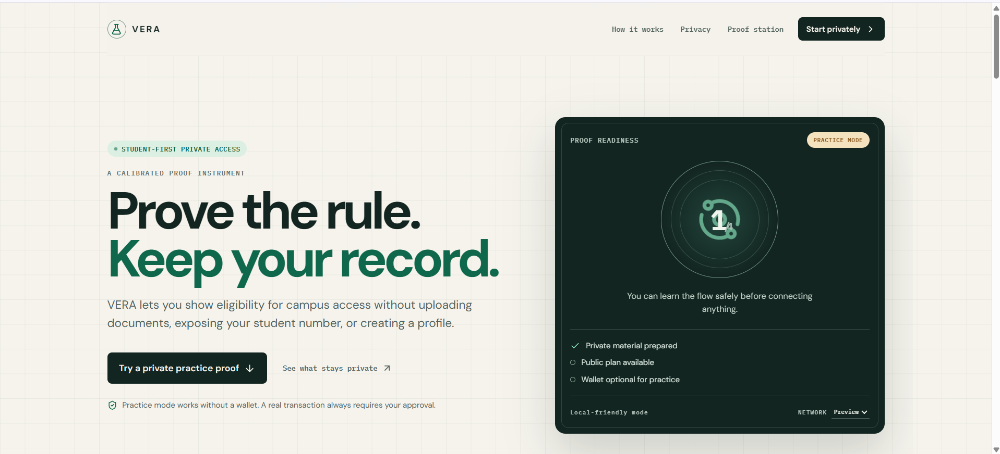
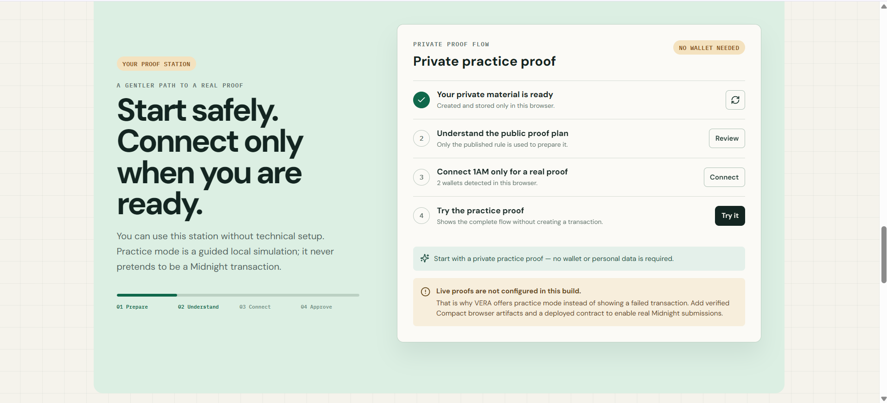
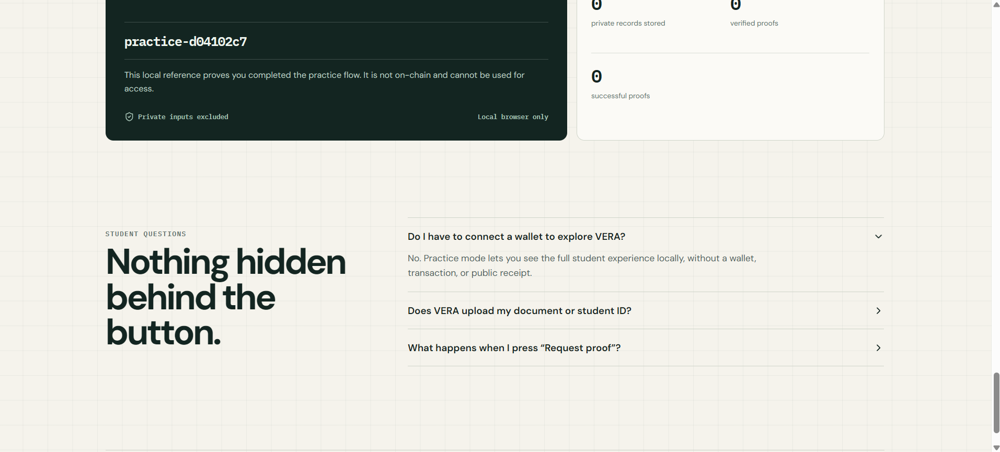
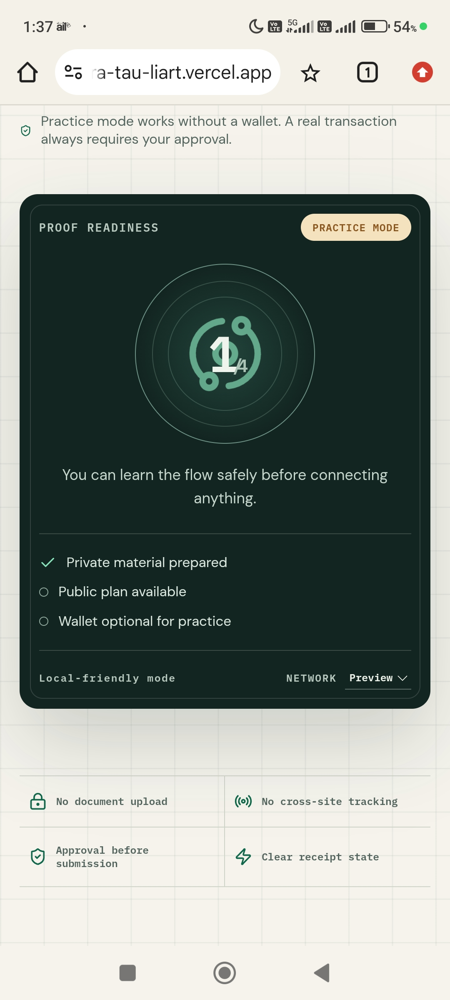
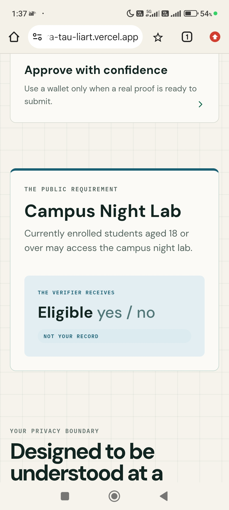

# VERA — Student Proof Station

VERA lets a student prove the Campus Night Lab rule without uploading a student document or publishing the facts that satisfy it. The verifier receives a finalized eligible result, a scope-bound anti-replay nullifier, and transaction metadata—not the birth year, enrollment flag, holder secret, or credential nonce.

The interface uses a scientific-instrument design language: calibrated status panels, visible checkpoints, restrained motion, clear privacy boundaries, and responsive layouts designed around a student completing the flow for the first time.

**Live website:** [vera-tau-liart.vercel.app](https://vera-tau-liart.vercel.app/)

## Preview

VERA's Compact contract was successfully deployed to the Midnight **Preview** network in block **1,062,902**.

| Deployment field | Verified value |
| --- | --- |
| Network | `preview` |
| Status | `SUCCESS` |
| Contract address | [`a43ac4ca5f9c2651f06fce47e5ae767e9d95d5d403de47801718a5b5cc63338d`](https://explorer.1am.xyz/contract/a43ac4ca5f9c2651f06fce47e5ae767e9d95d5d403de47801718a5b5cc63338d?network=preview) |
| Deployment transaction | [`746f86844c369f3372050d1eef846b353414647d3fd854b2903e8e0de39340da`](https://explorer.1am.xyz/tx/746f86844c369f3372050d1eef846b353414647d3fd854b2903e8e0de39340da?network=preview) |

## Preprod

VERA's Compact contract was successfully deployed to the Midnight **Preprod** network in block **2,746,503**.

| Deployment field | Verified value |
| --- | --- |
| Network | `preprod` |
| Status | `SUCCESS` |
| Contract address | [`a12be319a82cdb48704d514f210b6a5ca4f8a249aa91844e66c9631f875fd898`](https://explorer.1am.xyz/contract/a12be319a82cdb48704d514f210b6a5ca4f8a249aa91844e66c9631f875fd898?network=preprod) |
| Deployment transaction | [`17a6f1b1e65d6a7b813c1392ee2d5b62c621afdea4688ac7501750e36ab07400`](https://explorer.1am.xyz/tx/17a6f1b1e65d6a7b813c1392ee2d5b62c621afdea4688ac7501750e36ab07400?network=preprod) |

## Website Screenshots

### Desktop landing experience



### Desktop proof station



### Desktop receipt and student questions



## Mobile Responsive UI

| Student-first landing page | Proof-readiness instrument | Public policy and privacy boundary |
| --- | --- | --- |
|  |  |  |

## Live flow

1. The student reviews or edits a locally stored credential.
2. VERA explains the public policy; Gemini never receives the credential.
3. The student connects a compatible 1AM wallet on Preview or Preprod.
4. VERA asks 1AM to deploy a contract, or rejoins the address saved for that browser/network.
5. The wallet provides its indexer and proving services, balances the transaction, and asks for approval.
6. The student chooses `proveEligibility` (age + enrollment) or `proveEnrollment` (enrollment only). The selected circuit checks the private witness, consumes a scope-bound nullifier, increments the public aggregate, and discloses only success.
7. The UI displays a receipt only after Midnight finalization.

There is no demo-mode transaction and no `VITE_CONTRACT_ADDRESS`. A contract address exists only after the user approves deployment.

## Architecture

```text
Browser-local credential ── generated Compact contract + ZK artifacts
          │                                  │
          │ public policy only               └── 1AM: prove → balance → submit
          ▼                                                   │
FastAPI ── Gemini explanation / public receipts               ▼
          │                                            Midnight network
          └── Neon Postgres (public metadata only)
```

## Privacy model

| An observer can learn | An observer cannot learn |
| --- | --- |
| Public policy parameters, successful eligibility outcome, contract address, scope-bound nullifier, finalized transaction ID, aggregate count | Birth year, enrollment flag, holder secret, credential nonce, raw credential, document, wallet seed phrase, circuit private state |

The Compact constructor deliberately discloses the policy issuer key, minimum age, and policy year. Each proof deliberately discloses the nullifier and successful boolean because those are required for replay prevention and access. Private facts are read through the `localCredential()` witness and are never posted to the API or database.

Gemini receives only redacted public requirement text. FastAPI rejects obvious sensitive fields and uses a deterministic local fallback when no Gemini key is present. The database stores public receipt metadata only and rejects known private fields.

## Technology

- React 19, TypeScript, Vite, Framer Motion
- Midnight.js 4.1.1, DApp Connector API 4.0.1, Compact 0.31.1 / language 0.23
- Compiled Compact bindings, prover/verifier keys, and ZKIR committed in the repository
- FastAPI, Pydantic, SQLAlchemy async, Alembic
- Neon Postgres and the Google GenAI SDK
- Vercel for the Vite frontend and `/api/*` FastAPI function

## Local setup

Prerequisites: Node.js 22+, Python 3.11+, `uv`, Chrome with 1AM, and testnet NIGHT/DUST for live transactions. Native Windows is not supported by the Compact toolchain; compile through WSL. Runtime users do not need the compiler because the generated artifacts are committed.

```powershell
Copy-Item .env.example .env
npm ci
npm run dev

uv venv backend/.venv
uv pip install --python backend/.venv/Scripts/python.exe -e "backend[dev]"
backend/.venv/Scripts/python.exe -m uvicorn app.main:app --app-dir backend --reload
```

The Vite dev server proxies `/api` to `http://localhost:8000`. The FastAPI docs are at `http://localhost:8000/docs` outside production.

## Compile the contract

The generated artifacts in this repository target the current ledger-v8 / Midnight.js 4.1.x stack.

```bash
curl --proto '=https' --tlsv1.2 -LsSf \
  https://github.com/midnightntwrk/compact/releases/download/compact-v0.5.2/compact-installer.sh | sh
source ~/.local/bin/env
compact update 0.31.1
compact compile contracts/vera.compact contracts/managed/vera
cp contracts/managed/vera/keys/* public/artifacts/keys/
cp contracts/managed/vera/zkir/* public/artifacts/zkir/
```

CI recompiles the contract and fails if the generated contract, key, or ZKIR directories differ from the committed copies.

## Wallet and testnet use

1. Install and enable a 1AM wallet implementing DApp Connector API v4.
2. Select Preview or Preprod in VERA and connect.
3. Fund the wallet with the selected network’s test NIGHT and wait for DUST.
4. Press **Set up**. On the first run, approve the deployment transaction. Later sessions rejoin the saved address.
5. Press **Request proof** and approve the proof transaction.

VERA uses the configuration and proving provider returned by 1AM, so ordinary users do not configure indexer, RPC, proof-server, or contract-address environment variables. `docker-compose.prover.yml` is available only for developers who need a local proof-server process.

> **Preview and Preprod are separate ledgers.** The verified Preview contract above cannot sync into Preprod. A Preprod wallet needs Preprod test funds/DUST and must approve a separate contract deployment; VERA stores the resulting address independently for each network.

## Gemini and Neon

`GEMINI_API_KEY` is server-only. `DATABASE_URL` is the pooled Neon URL used by the Vercel function; `DATABASE_DIRECT_URL` is the direct, unpooled URL used only for Alembic migrations. Create separate Neon development and production branches.

```powershell
$env:DATABASE_DIRECT_URL = "postgresql+asyncpg://...direct-neon-url..."
backend/.venv/Scripts/python.exe -m alembic -c backend/alembic.ini upgrade head
```

## Verification

```powershell
npm run contracts:validate
npm run lint
npm test
npm run build
backend/.venv/Scripts/python.exe -m ruff check backend api
backend/.venv/Scripts/python.exe -m pytest backend/tests
```

## Vercel deployment

Import the repository root into one Vercel project. The included `vercel.json` builds Vite into `dist` and routes `/api/*` to `api/index.py`.

Add these production variables:

- `DATABASE_URL`
- `GEMINI_API_KEY` (optional; deterministic fallback remains available)
- `GEMINI_MODEL`
- `ENVIRONMENT=production`
- `ALLOWED_HOSTS=your-project.vercel.app`
- `CORS_ORIGINS=https://your-project.vercel.app`
- `VITE_API_BASE_URL=/api`
- `VITE_PROOF_ARTIFACT_BASE_URL=/artifacts`
- `VITE_DEFAULT_NETWORK=preview` or `preprod`

Do not add a contract address. Do not expose `DATABASE_DIRECT_URL` unless you run migrations from a trusted deployment job; Vercel request handlers do not need it.

See [the production checklist](docs/PRODUCTION_DEPLOYMENT.md), [architecture](docs/ARCHITECTURE.md), [privacy model](docs/PRIVACY_MODEL.md), [demo script](docs/DEMO_SCRIPT.md), and [product proposal](docs/PRODUCT_PROPOSAL.md).

## Repository structure

```text
contracts/              Compact source and generated bindings/artifacts
public/artifacts/        Browser-served prover keys and ZKIR
src/                     React UI, local credential, 1AM/Midnight integration
backend/                 FastAPI, SQLAlchemy, Alembic, Gemini boundary
api/                     Vercel Python entrypoint
docs/                    Product, privacy, architecture, and deployment docs
.github/workflows/       Reproducible verification pipeline
```

## Current external actions

The code, generated circuits, tests, and production build are local and reproducible. A real deployment still requires the repository owner to connect GitHub to Vercel, create Neon credentials, and approve wallet transactions with a funded 1AM account. Those actions cannot be safely performed from source code.

Live website: [vera-tau-liart.vercel.app](https://vera-tau-liart.vercel.app/). Repository: [asthaagarwal252-lab/VERA](https://github.com/asthaagarwal252-lab/VERA).
